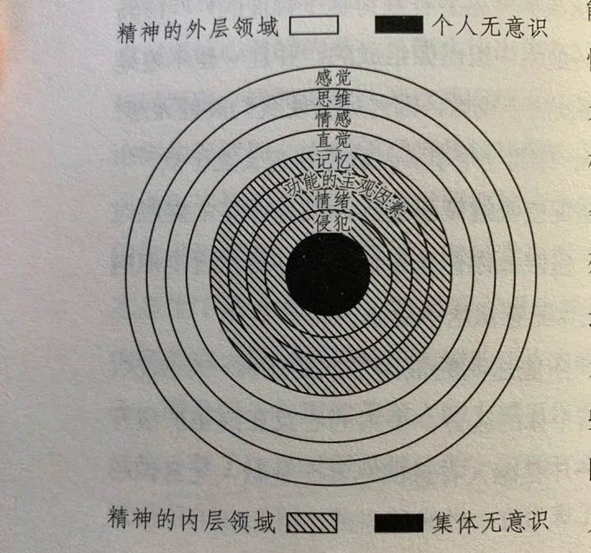

### 序2：荣格八维认知功能基础概念辨析：内倾感觉（Si），内倾情感（Fi），外倾情感（Fe）与情绪（emotion）

首先我想声明一点，我们了解心理学相关知识是为了更好的理解自己和其他人，认识清楚自己在世界的位置，帮助自己和他人进步，而不是暴力的对其他人贴标签，同时一定要认识到人的性格也是可以流动的，人的心态是浮动的，价值观是可以变动的，同时除此之外，每个人的生活环境不同，每个人的八大认知**功能整合**的程度不同，同时功能的主观因素不同，**来自社会环境的输入不同**，即使是认知功能相似的人，他们的外在表现和价值观也会有很大差异。**每个人都是独特的**~ 所以一定要认识到人的主观性！！！

同时，mbti的十六种人格只是根据数据拟合出来的**比较稳定**的人格结构，如果八种功能能够按照功能强度排序的话，可以有8! = 40320 种人格组合。其中有的功能严重对立，同一种功能的两个态度是一体两面，并且不同的功能之间存在着一些不可言喻的关系，比如Fi和Si的分化和年龄有关，Fi和Ti作为内倾的理性功能也并不是想象中那么对立。荣格在著书的时候也说过，一个理性功能和一个非理性功能能够组成一个完整的人格，而并没有表示两个认知功能需要态度相异，但是现代mbti学说中一般认为态度相异的理性功能和非理性功能组成的人格结构**比较稳定**。所以人群**大致**可以划分为这十六种人，但是如果直接用十六种标签贴给具体的个人并且用刻板印象去理解他人就是一件很愚蠢的事情了。Mbti原型只是一个精神分析的框架，这十六种人格原型几乎能够拟合绝大多数人类。

先走进标签，再走出标签，是每个mbti学习者在学习过程中需要保持的态度。

在mbti大量吹水聊天贴中，我们经常会对一些基础的概念进行混淆，然后造成了大量的刻板影响，比如:INFP（Fi dom）很容易情绪化都是流泪猫猫头，ESFJ（Fe dom） 很会讲话，这种人是不是很虚伪，T系人不容易情绪化，Fe dom人一定Fi很弱等等。
在日常生活中，由于视野和信息收集的局限性，以及来自个人的偏见，我们很容易把身边个别案例当成是普遍适用的道理，这也就是所谓的身边统计学。身边统计学本身是没问题的，是我们收集信息整合的一个方式，而有问题的是拒绝反思自己的态度，依赖于惯性解决问题。
先简单聊一聊上文提到的几个概念吧，如想对于概念有深刻的理解肯定需要自己看书翻帖子花时间的，我这里用我的理解简单说一下，会有信息传熵增（可能有错误，因为我不是专业的，也没时间查那么多书）（此处举例的我非真实的我，只是为了举例说明，方便理解 = =）：

Fi（内倾情感）：来自于个人情感的判断，落点在理性判断上，是个人对于来自自身价值观的坚持，这种力量来自于自己的内心，举个例子，我喜欢二次元（笑死），这种就是一个很主观的理性判断，这种喜欢的情感是一种自身理念的树立，而非冰冷冷的逻辑形式推理，不是说这其中就没有逻辑了，只是这种逻辑人类无法读出来然后用逻辑推导一遍，同时这种情感也能触发强烈的情绪体验。有时候这种情感甚至会对抗来自外界的价值观，就像天气之子里面帆高为了救阳菜愿意对抗整个世界。再举几个例子，我向往正义和自由，这是我毕生的追求目标，即使和世界作对（区别于Fe）；我认为人与人之间的信任是非常重要的，我将从自己做起，我不会去欺骗别人，并且坚持这个理念；我非常瞧不起那个战场上的逃兵，我认为战士死在沙场上是很光荣的事情。以上的这些都落在了判断而非感受上，并且这种判断是很难用外在的逻辑形式去推导的，比如让你说出你为什么有这样的道德观，你可以举出很多例子，这种无法用逻辑做形式推导，也能够引发强烈的情绪感受，这是区别与T（思维）的一个点。

Fe（外倾情感）：是个人对于社会价值观的接受以及反应，落点也是理性判断上，作为个体的人希望被社会所接纳，希望融入集体，主动接受来自社会的观念，同时Fe也是能够产生情绪的，他产生情绪的来源可以是因为被集体接纳所以感到很开心，也可以是因为不被集体接受而痛苦，也可以是因为自己对于无法让集体变成自己想要的样子而难过，也可以是因为自己对于集体的付出得不到足够的反馈而感受到痛苦等。Fe的落点在于来自外界的观念而不是来自与自己的观念。举个例子，我看到一个路边的乞丐，我虽然无法感受到他的痛苦，但是我觉得帮助乞丐是一个被社会价值观所认可的行为，所以我给了他钱。这里的落点是希望被社会所认可，而不是出自于自身的内在价值观（Fi）。再举几个例子，我们一群人去看画展，大家都认为这幅画很好看，我虽然对于这副名画没太多感觉，但我还是对于大家的观点表示了认同；老师说，大家要有集体荣誉感，一起齐心协力才能办大事，我们是一个整体。Fe同Te（外倾思维）的区别在于，一个是在情感上希望融入外界，一个是希望在理智上融入外界，后者相比于前者，在情感上是冰冷的。

Si （内倾感觉）：是一种客观事物的主观体验，落点在主观感受上，也能够引发情绪体验，举个例子我去猫咖撸猫，一只猫是黑脸，一只猫是白脸，我看到白脸就很喜欢，我看到黑脸就很讨厌，虽然我不知道为什么。这种行为就是一种很主观的体验，黑猫和白猫对于不同的人来说体验不一样，有的人就是喜欢黑脸，而有的人喜欢白脸，而我喜欢白脸，这是一种个人的非常主观的感受，是非常个人化的，有的时候甚至这种主观感受太强了容易看不到事情本来的面貌，也无法享受真实的体验感受。再举几个例子，我看到了饺子就想到了春节，我回忆起了和人家在一起的点点滴滴，我感觉到内心暖暖的；我看到一轮残月在天空上，我想到了自己也是孤身一人，我不由自主的开始难受；她为什么不回我的消息，我反复看着聊天框一遍又一遍的刷新着有点难受；你妈看见了你只穿了一件衣服，所以她觉得你冷。内倾感觉区别于内倾情感，落点在感受，而没有判断过程的升华。

emotion (情绪)：情绪是一种生理上的反应，是一种内部的主观体验在外部的表现，比如高兴，恐惧，难过，愤怒，紧张，痛苦，激动等等等。

总结一下，其中Fi/Fe是**理性功能**，而Si是**感知功能**，emotion是**生理反应**。其中Si功能可以通过因为感受情绪到所以树立了价值观，从而升华到Fi，这两者有部分联系的。Fi/Fe/Si 在使用过程中 都会产生不同的情绪（emotion）体验，而这些情绪体验的深度，时间跨度都有所不同。
一般来说，Si产生的情绪是短暂的，深度比较浅的，而Fi产生的情绪是高强度的，深远的，长久的，可能长时间都难以改变的。Fe产生的情绪强度可能不如Fi，但是时间是也很深远（我瞎猜的）。
我们每个人都是有八功能的，只在于潜意识对其进行的重要程度排序和功能强度以及功能使用频率不同。我们在判断某一件事的时候，是多个功能平衡后的结果，不是说你在用Fe就不会使用Fi了，只是我们在潜意识会对其进行排序，对想法进行汇总整理。
同时我们日常生活中的同一个行为可以是Fe的结果，也可以是Fi的结果。比如说我看到同学受伤了，我去安慰他，这个时候你去安慰他的动机可以是不同的。比方说，我觉得受伤的人很可怜，我认同需要帮助有困难的人，这使得我更能够被社会所接受，虽然我没有感同身受，这就是Fe的一个表现。换个角度，我看到受伤的同学，我想起来了我曾经也这样，我能够回想起我当时身上的痛觉，我真心想帮助他，这是Fi的一个表现。
日常生活中，如果我们把别人身上的Fe和Fi弄混淆了，是很容易闹出笑话的。Fe是广域魔法，对于每个人表现都一样，与群体共情；Fi是单体魔法，锁定了个体，与个体同情。

#### INFP和流泪猫猫头

回到上文几个问题，上文已经详细介绍了Fi和Si的区别，Fi产生的强烈的情绪是因为触碰到了价值观于是产生了强烈的情感，而Si产生的情绪只是感受上的，缺少到价值观的升华，这是理性功能和非理性功能的差别。
INFP原型的功能堆栈：Fi(dom) Ne(aux) Si (tert) Te(inf) / Fe Ni Se Ti
**(这里随口提一句，阴面的功能强度不一定低，只是相比于阳面功能的在潜意识中的偏好程度，发展完善的人阳面阴面功能整合的都很好)**
我们判定一个人mbti原型的时候，是从他的出生开始养成的固化思维倾向来看，主要是前两功能，INFP的前两功能是Fi和Ne，这也应是唯一认定是否INFP的标准，一个INFP人，他可以替补功能Si发育很差。
Mbti测试这个傻逼就傻逼在，所有的人在抑郁的情况下基本上都能测出INFP，而INFP本身和抑郁没关系，Fi带来的给INFP的是更容易的强烈的情绪波动以及对于价值观的坚守。只有在Si功能不正常的时候，Fi和Si联动形成loop容易让INFP陷入抑郁的深渊，而本身Ne发展不错的是自带免疫抑郁症的，甚至很多低Si的INFP就很不长记性的那种（本身来说Ne才是判定*NFP群体的唯一依据）。而论坛上对于INFP的评价，到处是无病呻吟，给INFP群体贴标签和负面化过于严重。而这个无病呻吟到底是Fi还是Si可以仔细想想，所以其实绝大部分的测试结果是INFP的大部分是其实应该是 XXXX 和 XXXX 。
所以INFP和流泪猫猫头的关系我想基本不攻自破。

#### Fe和虚情假意

Fe本身是一种很乐观积极的心态，希望融入到集体之中而较少考虑自己的心情，它希望自己能够融入集体，也希望能够改变集体，也渴望得到来自集体的反馈。
ESFJ原型的功能堆栈：Fe(dom) Si(aux) Ne(tert) Ti(inf) / Fi Se Ni Te
与其说Fe是一种虚伪，自己没有身同感受而愿意做面子工程，不如说Fe是一种最无私的功能，较少考虑自身的情感而希望融入集体改变集体。当社会的价值观是正面的，个人受到的教育是正面的情况下，最纯粹的Fe表现出的反而是最宝贵的品质。
即使是在现实生活中，Fe在很多时候被用在了恶的一面，被用来搞团体排除异己，或用以道德绑架。但是这并不是真的Fe的本身的样貌。又或者是因为Fe被利用起来达成自己的不可告人的目的，又或者是因为来自社会价值观的输入导致的偏见。
但是真正的Fe并不等于虚情假意。

#### T系人没有情绪

上文写了，情绪可以来自于理性功能Fe/Fi，也可以来自于非理性功能 Ne/Ni/Se/Si，很多时候T系人会用Ti/Te 来压制住情绪，而让外人看不到他的情绪体验。反而当T系人理智失控的时候，情绪会以更加原始狂暴的形式表现。

#### Fe人一定Fi很弱

问出这种问题属于是对于原型理论了解不够，Fe和Fi只是一个在阳面一个在阴面，是在潜意识的偏好度和排序，如果Fe在一号位国王，Fi就在五号位使徒，Fe在二号位宰相，Fi就在六号位批评家，其中五六号功能位是平衡阴面阳面功能的关键，其中一二号位置功能的发展会带动五六号位功能的发展，二三功能也能带动六号位功能的发展，Fe高的人Fi可以非常低，同时也可以Fi很高，肯定有人Fe和Fi双高的，这都是没有问题的，只是看个人怎么**平衡取舍**，只是功能偏好度的排序不同，这个偏好度也不是绝对的。

举个例子，像是《[我的青春恋爱物语果然有问题。](https://baike.baidu.com/item/我的青春恋爱物语果然有问题。/18237821?fromModule=lemma_inlink)》中的由比滨结衣，就是典型的外倾Fe（dom）Si(aux) ，可以推断出团子的mbti原型为ESFJ，同时团子的Fi也是比较高的，她也在追求真物，也渐渐改变的逐渐能够表达出自己的想法和心意。
Ps: 为什么说团子是Fe dom，因为团子很善于迎合其他人，经常看人脸色做事，不能很坦率表达自己的想法，同时也是很善良的人（Fi)，至于为什么是Si举个例子，其实可以从团子接近大老师的理由也可以看出来，因为救下了宠物狗，所以给团子留下了强烈的主观感受，所以她开始关心大老师，这基本很符合Si的特点。

（不想写了，差不多算是写完了，累了，摆烂了就这样吧。）
