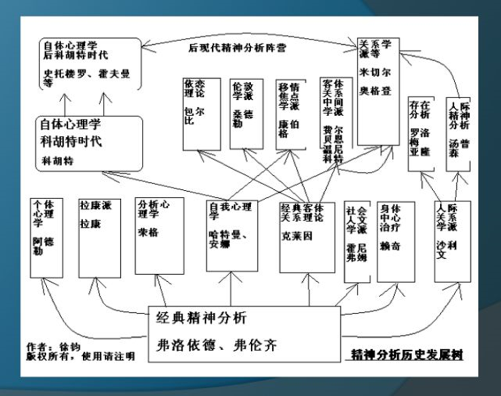
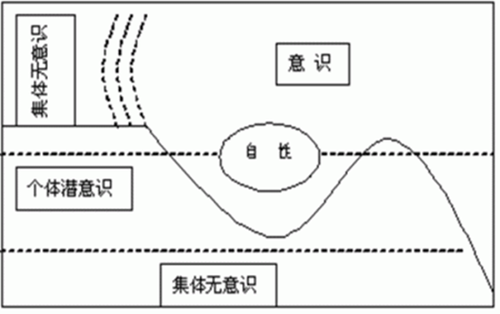
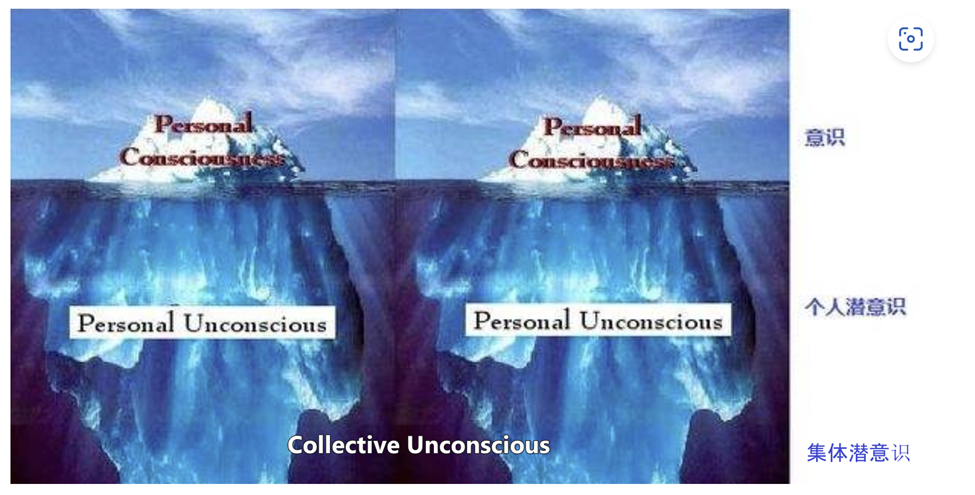
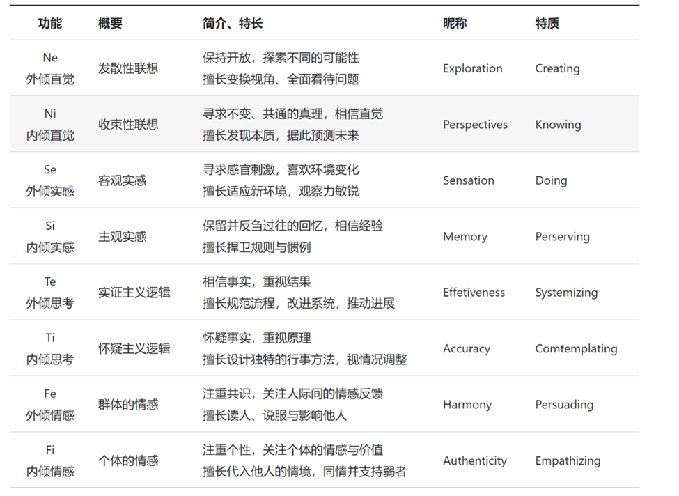
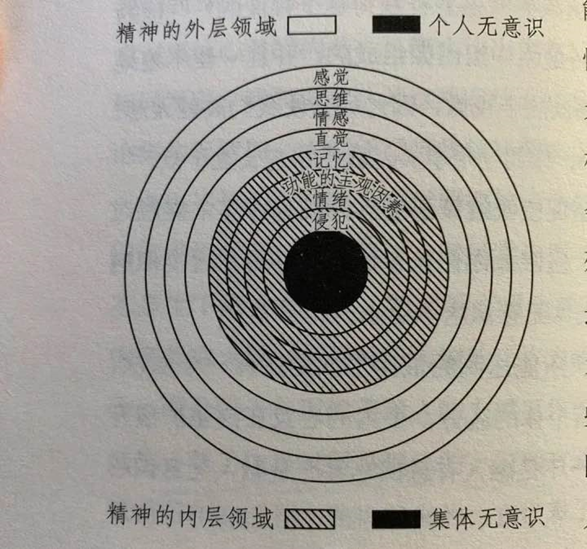
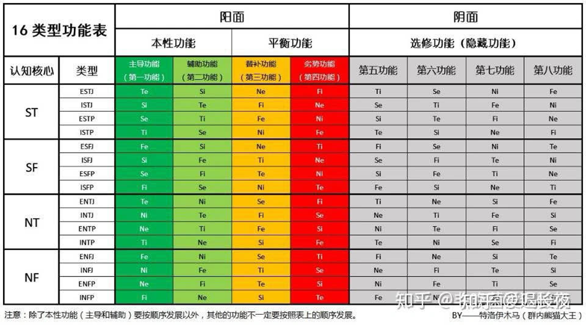

### 序：从现代心理学到精神分析：mbti 测试是伪心理学吗

在mbti 性格测试爆火的当下，各种社交媒体上充斥着相关话题的讨论，甚至我们能够看到各种交友自我介绍里面，都标榜了自己测试的人格类型，毫无疑问，mbti 已经成为了一部分当代年轻人的社交工具。而16personalities 是一个mbti 常用的免费测试网站，当我们做完了近百道测试题后，网站会给出一个16个人格中对于的其中一个类型，从E 外向/I 内向, N 直觉/S 现实, T 逻辑/F 感受, J 计划/P 展望 外加一个该网站自定的特质 A 坚决/T 谨慎，以及一份性格报告，介绍其优势和劣势等等。

对于一部分人来说，他们测试出的维度可能不明显，他们对于给出的评测结果不够满意，好像结果里面的人既是自己又不是自己；而对于另一部分人来说，他们每个维度倾向都很明显，同时他们愿意相信测试结果中全是表扬的话语，以为所有美好的评价都是真实的自己，迷失在了相关的名人效应里面，在赞美声中忘乎所以。还有的人对此十分感兴趣，甚至做过几次测试，但是每次得到的结果都不一样，于是再也不相信测试结果了。（下面我要发表**暴论**了，各位仁者见仁智者见智，其实认真地来说，按照原教义，人的**性格**开朗或者自闭以及表现出价值观这些**外在**是可以改变的，而mbti**人格**理论在**成年进入社会**以后对于**原型**上**每个人是固定的不可改变的**，认知功能本质上是**认识世界**的方式，是印在你记忆**最深处**的最根本的**思考习惯**，只能**发展当前优势和劣势以中和**从而可以**很熟练表现出另一性状**而不能改变原来的**根基**，人在某个阶段不可能**完全颠覆**以前的**思考方式**，他可以获得新的**思考方式**，但他的**无意识**一定会**更倾向**于从什么方面思考问题，因为用了更久也更熟练，长时间表演另一种人格强行改变自己的思考方式会加大心理的负担，参考**原型理论**的**认知结构**，我这里说的是**原型**，而不是**测试结果**）。

于是我们不禁会问，mbti测试这个东西，它是否是科学的，是正经的心理学吗，能帮助我探索真实的自己吗。

在讨论今天的话题之前，我先给出我的看法：

1），首先 mbti 测试首先不是**心理学** 更不是**科学**，只是一张**心理测量表**，同时因为表设计的不合理性，由于含有大量主观的试题，在测试者不同心境下面选出来的答案可能完全相反，测重率极低，这一点我们可以在[Myers–Briggs Type Indicator - Wikipedia](https://en.wikipedia.org/wiki/Myers–Briggs_Type_Indicator) 里面找到相关的数据证明

2），同时mbti测试二分的判断方式还有部分模糊的评价，以及迈尔斯母女将荣格的理论直接暴力的映射到了四个维度，增加了J/P维度原本在荣格理论之中不存在的结构。于此同时，mbti本身从四个维度来解释人格的理论全是错的，用mbti测试来达到认识自己的目的很大可能测不准，错误的心理认同反而更加可能引发不良的情绪从而诱发神经症，例如：抑郁，焦虑，强迫等

3），mbti测试的爆火只是资本催生的低成本高回报生意，这点不做赘述

 

既然mbti测试的结果是不具有足够的信效度的，那么是否其毫无可取之处呢？文章上面也提到了，还有一部分人每个维度倾向很明显的，他们有的人认为人格测试是准确的，而这一切总不能完全归总于巴纳姆效应，那么这背后的原理又是什么呢，这是一个值得考虑的问题。

#### 从现代心理学到精神分析

精神分析学（Psychoanalysis），是19世纪末由奥地利帝国神经学家西格蒙德·弗洛伊德（Sigmund Freud）创建的一门学科（没错，就是那本梦的解析的作者），是治疗神经症的一种方法。弗洛伊德提出了意识无意识，精神结构（自我，本我，超我），俄狄浦斯情结等等一系列学说。

卡尔·古斯塔夫·荣格(Carl Gustav Jung)是瑞士的心理学家，是弗洛伊德的二弟子（大弟子阿德勒），合作推广精神学说长达6年之久，后于弗洛伊德理念不合，分道扬镳，创立了分析心理学理论（Analytical psychology），提出了情结的概念，把人格分为内倾/外倾两种，主张把意识分为意识，个人无意识，集体无意识三层。分析心理学也可以说是精神分析的一个分支。

> 分析心理学是20世纪早期诞生的一门探究人类心灵原始意象的深度心理学，它的创始人—瑞士精神病学家、精神分析的代表人物卡尔·荣格是在以弗洛伊德对人类无意识的发现为基础上，根据自己亲身体验及在对临床病人的大量观察和广泛研究了各[民族宗教](https://baike.baidu.com/item/民族宗教/2962122?fromModule=lemma_inlink)神话之后，提出来的一套颇具说服力的人类心灵深层结构理论  。

这部分历史我不想讲太多，有兴趣的可以去自己了解。那么这部分理论和我们上面所谈的mbti测试又有什么关系呢，如果有了解过mbti的发展历史，迈尔斯母女本身非心理学家，她们是从荣格的理论中得到了启发，于是设计了mbti测试这一套心理测试量表。

现代心理学是什么？首先我们提出这样的一个问题？你说的这个精神分析，它是科学吗，它有用吗？我们可以接着提出来下面这样一个疑问。

笔者简单查证了一些相关资料，现代心理学是多个流派的融合，走的是科学方法与整合的路线，人本主义学派，行为主义学派，认知心理学派，精神分析学派，结构主义学派，功能主义学派，各个学派都卷入了心理学的发展之中，其中当代研究重点是神经认知科学和量表测量数据，在心理学的研究之上引入了生物，信息科学等等手段（应该大概率是对的，错了别打我，我又不是心理学专业学生，错了不也很正常）。

精神分析作为心理学流派整体的一部分，在当代日渐式微，最起码不是当代心理学的主要研究方向了。心理学专业的学生可能在本科阶段会稍微的接触到精神分析然后一笔带过，更有甚者被踢出了培养方案之外，比如笔者所在的大学就是如此。但是在学科的应用上，在国内外心理学临床还是有不少在使用动力心理学（属于精神分析学派），在西方来说虽然不是主流，但也不是销声匿迹了，处于在认知疗法和行为疗法之后，居于第三。

为什么精神分析在一些地方被排除在了本科培养方案之外呢？其实简单查证之后可以发现，精神分析是非科学的心理学，也可以说是一门哲学与心理学结合的成果，非科学的心理学没有底层的根基，一般难以扩展，寻常人难以在上面做到更深入的研究，只有像是弗洛伊德，荣格，拉康，阿德勒等人一样的大能者，有着极其丰富想法和无比的前瞻能力，可能对精神分析理论进行重构或者是和其他理论进行融合，历时说不定能重新让精神分析学派迎来新春。

精神分析更像是经验与哲学的总结，就像是古典化学。在心理学没有摸清楚元素周期表的时代，总结原子的特性，然后整理总结出一条结论，它不是完全的真理，但是一个完整的系统理论又能够解释我们生活中的很多现象，当然也会遇到不适用的时候，这个时候我们需要对理论打个补丁，我们就可以说，它几乎是正确的，它基本是正确的，虽然它不是真理。

科学是什么，现代评判科学的标准来自于波普尔的可证伪性，一个学科是否可以证伪，成为它是否是科学的依据。如果单从这条理论来看，那我们当代研究的一切人文社科学都属于非科学。就像是股票交易砖家每天在电视台的瞎叫也是毫无意义的。

**非科学，就不对吗？**

我想不是这样的，虽然作为一个当代的理科生，我们总是会被预先灌输一个思想，评价一个事情是否正确要从它是否科学上看。但是这个观点本身就是一个错误，科学不一定是正确的，就像牛顿力学在微观世界也会失效，需要量子力学来补充说明；非科学也是有意义的，它作为理论也可以指导我们人类进步和前行。同理，我认为疯狂打击宗教，周易，塔罗牌甚至是巫术等也是没有必要的，我们应该承认其存在的意义。

那么，到底什么才是正确的呢，笔者在这里内心的结论是我们要抱着批判性的思维来看待世界上的一切学科，一个学科是否允许被质疑，被批评，如果它能够自圆其说那么它就是有意义的，如果一个学科完全不允许被怀疑，它总是坚持最古老的原始概念而拒绝与时俱进，那它就是不应该被接受的，即使它在很多地方很实用。

心理学是研究人和社会关系总和关系的学科，而不仅仅是研究个体的学说，如果没有社会这个概念而每个人都是单独的个体，不需要和外界交互的话，那心理学在很多时候也没有意义了。心理学本身在科学界就属于是最不科学的学科，所以在科学**实证主义**的当代拼命往科学上靠拢，试图证明自己是科学的，它采用自然科学的方法，研究你的脑电波，神经递质的传递，而这条道路究竟是否正确，像我们一样的圈外人是无法评判的。

所以我的结论是精神分析是有意义的，个人简单的学习和了解以及是完全没有问题的，但是需要保持怀疑的态度来看待其内容。

（为什么我废话这么多，我简单的解释一下，这相当于疯狂给自己叠甲，秉持着理科生的理性主义，把事情的来龙去脉说清楚，防止收到不良居心的人的言语攻击，如果还是要攻击我的言论或者怀疑我的想法那就随便了）

#### 从mbti到荣格认知功能

要搞清楚mbti测试的来龙去脉，需要从荣格老爷子的理论出发，首先我们要回到原教旨的分析心理学，理解人格论在荣格整个理论中的位置。

荣格提出的主要心理学学术理论有：

- 人格整体论：

  人格整体论是荣格分析心理学的核心理论，荣格把心灵当作心理学的研究对象，人的心灵是一切软件内容的全体，包括思维，情感，行动等一切能够意识到的，也包括一切潜意识不能被人们所意识到的。在荣格看来，心灵或者是人格结构是由意识（自我），个体潜意识（情结）和集体潜意识（原型）三个层面组成。

- 人格动力说：

  荣格认为人格动力推动人格的发展，认为心灵的能量来自外界或者身体，一旦外界能量转化为心灵的能量，就由心灵来决定其使用

- 人格发展论

  荣格认为心理发展的最终目标是个性化，要经历一系列的发展阶段。

其实mbti理论灵感来自于荣格的人格整体论~

上文说了，荣格认为人的心灵或者是人格结构是由意识（自我），个体潜意识（情结），集体潜意识（原型）等三个层面所构成。

意识是人格结构的最顶层，是心灵中**能够被人觉知**的部分，如知觉，记忆，思维和情绪等，其功能是使个人能够适应其周围环境。自我是意识的中心，是自觉意识和个体化的目的所在。荣格认为，意识是心灵中很少的一部分，具有选择性和淘汰性，正是于自我才保证一个人人格的统一性、连续性和完整性。

个体潜意识是人格结构的第二层，包括一切被遗忘的记忆、知觉和被压抑的经验，以及属于个体性质的梦等，可以进入意识内领域。

集体潜意识是人格或心灵结构最底层的潜意识部分，包括世世代代的活动方式和经验库存在人脑结构中的遗传痕迹。不同于个体潜意识，它不是个体后天习得，而是先天遗传的；它不是被意识遗忘的部分，而是个体始终意识不到的东西。

就像上图一样，我们能够大脑里面存储的内容，能够被我们意识到的只有很少的一部分。

《心理类型》(Psychological Types)是荣格的著作，阐述了荣格的心理学类型理论。

首先荣格提出了两种一般态度类型，外倾型和内倾型。

> 外倾以他的努力**朝向客体**和它**对客体的共情与认同**而与众不同，他的**意志依赖客体**。他努力的同化客体，同时又受到客体的影响。（荣格，1971:317)

> **内倾的显著特征是一意孤行地与客体对立。他与任何对客体的依赖作斗争**.他拒绝客体的任何影响**，甚至有些害怕客体，所以他会越发的**依附概念，这些概念使他摆脱外在现实并获得内在自由的感觉，尽管他要为付出一个非常引人注目的权利心理。（荣格1971: 317-318)

知乎大神 林川登罗 对此有很好的解释

> 如果用[绝对化](https://www.zhihu.com/search?q=绝对化&search_source=Entity&hybrid_search_source=Entity&hybrid_search_extra={"sourceType"%3A"answer"%2C"sourceId"%3A2335002135})和单象论举例可能就是，**外倾想要融入客观世界，并同时改变客观世界，内倾想要客观世界莫挨他们，并且逃避客观世界对他们的影响**。——林川登罗《荣格八维导论：打破MBTI八维的刻板印象》

同时荣格也提出了意识有四种功能，两种非理性功能：感觉Sensation，直觉Intuition，两种理性功能：情感Feeling，思维Thinking。

这里比较反一般常识的是，荣格将情感放在了理性功能里面，我们一般人总认为情感是非理性的，其实不然，是因为我们日常生活中，把情感和情绪两个词经常混用在一起，在心理学上，情绪是emotion，而情感是feeling affection，情绪是较低级的感情，适用于人类和动物，而情感是比较高级的感情，只有人类这种高级生物才有（亚托莉：地球，也包括我吗），与价值观的建立有关。

理性功能和非理性功能的最大区别就是，理性功能所作出的反应总是与大脑中的理性法则一致，而非理性功能则是在追求纯粹知觉，它们被尽可能的驱使着否弃理性。

意识的四种功能又受到两种态度，即外倾和内倾的影响，一共可以组成八种心理类型认知功能，即：

-  外倾感觉（Extraverted sensation）/ 内倾感觉 （Introverted sensation）
-  外倾直觉（Extraverted intuition）/ 内倾直觉（Introverted intuition）
-  外倾思维（Extraverted thinking）/ 内倾思维（Introverted thinking）
-  外倾情感（Extraverted feeling）/ 内倾情感（Introverted feeling）

我们在讨论问题时，一般对其进行缩写表示，Se表示外倾感觉，Si表示内倾感觉，Ne表示外倾直觉，Ni表示内倾直觉，同理，Te代表外倾思考，Ti表示内倾思考，Fe代表外倾情感，Fi代表内倾情感。

我们一般认为每个人的人格都是由这八种认知功能组成的，区别只在于占位顺序和功能强度不同。

想要清楚认识这八大功能的具体作用，是**一定需要**深入到荣格的著作《心理类型》之中，去看看荣格的原话是怎么说的，看看荣格对其描述和定义以及举的例子，最后再去知乎上看大神们的讲解分析，最后才能对其有一定的理解。而我们在互联网上冲浪的时候，往往了解到的都是功能的**刻板印象**，或者是功能**发展过度不受限制**导致机能运作异常所暴露的缺点，甚至是**错误**理解，把其中一个功能的态度**混淆**成了另一个功能态度。

举个例子，功能A很容易导致B行为，甚至它的一般表现就是B，那么我们能说如果你有B行为，那就一定是功能A导致的么？是不可以的，我们要知道的是，用结果反推过程是错误的，其实功能C也有概率导致B行为，甚至功能D在极其罕见的情况下也能够导致B行为的发生。

用实际生活中的现象举个例子，小A待人很礼貌，对每个人能都是笑笑容可掬，这种行为其实不一定能说明小A是想主动融入集体，同时也有可能是小A自己的坚定的信念让她一直保持这个行为而她对于融入集体这件事无感，甚至有可能是小A经过没有感情的思考之后，得出了结论，保持笑脸是好的，虽然她不喜欢这样，但是这样能够利益最大化。而这三种心理过程是截然不同的。

同理，相同的功能可能导致相反的结果，比如教徒A和教徒B，他们信仰不同的宗教和教义，A对异教徒是赶尽杀绝的态度，而B对其他教的人则是尽力去感化。

不过我们首先了解这些认知功能的时候，还是先从表象认识比较好，也就是先从刻板印象入手，然后阅读原著深入理解之后，结合更多事实分析，我们从概念上再判定对应的行为更大可能是用了什么功能。

（我说这个主要是为了防止大家形成偏见，什么样的人格一定会有什么表现，不要把功能和具体表现绑在一起，这个是不一定的，要从功能的定义出发，而不是抄近道认为表现就是功能）

这个时候有人可能会问，难道我们所有的心理行为都是由这八种功能决定的吗，其实不然，整个认知功能相关的内容其实只是荣格整个学说中的很一小部分，分析心理学包含了上文所提到的所有的心理学学术理论，对于个体无意识，以及集体无意识，原型理论等的分析，整个学说系统庞大无比，理论体系架构其实是很完整的。所以我们不能用认知功能来解释人类的所有心理活动。荣格在《分析心理学的理论与实践》里面自己画了一张图，表示认知功能只属于**精神的最外层领域**，而**精神的内层领域**还包括了记忆，功能的主观因素，情绪，侵犯等等，上文也提到过，同时个体潜意识也是能够进入到意识的领域内。

简单来说，人做梦的行为不能从认知功能分析，你的情绪不一定能从认知功能分析，你的记忆也不能从认知功能分析，你的潜意识行为也不能从认知功能分析，最最重要的是，可爱的高性能机器人**亚托莉** 也不能从认知功能来分析 !

毕竟认知功能只是精神意识的最外层吗~

上面说了这么多，那么这到底和mbti有什么关系呢，那么开搞~众所周知，mbti体系将人格分为16种类型：

| ENFJ | INFJ | ENFP | INFP |
| ---- | ---- | ---- | ---- |
| ENTJ | INTJ | ENTP | INTP |
| ESTJ | ISTJ | ESFJ | ISFJ |
| ESTP | ISTP | ESFP | ISFP |

可以看出，每个类型由四个字母组成，其中E (Extroverted) / I (Introverted) 是我们上文所提到的两种态度，S (Sensation) / N（Intuition）对于到我们上文所提的两种非理性认知功能，T（Thinking）/ F（Feeling）对于到我们上文所提到的两种理性态度，J（Judging）[计划] / P (Perceiving) [展望] 是迈尔斯母女根据自己的理解，为了区别 功能-态度的组合而加上去的，荣格的学说里面压根**没有**提出过J / P 这个概念。再提一句，某16persionalities 网站擅自偷换概念加上去的特质 A (Assertive) [坚定型]/ T (Turbulent) [不稳定型]，但凡稍微了解过荣格学说的人都会觉得这十分可笑，都不止是画蛇添足了，简直是离谱他妈给离谱开门，离谱到家了。

“你看那个人好卷啊，他一定是个铁J”

“你看那个人懒懒散散，他肯定是个铁P”

先不论刻板印象的问题，J / P 这两个到底区别是什么，mbti用有计划有条理和灵活性和即兴发挥区分，无疑又是给mbti测试画上了更加刻板的印象。

那么迈尔斯母女真是不干人事吗，mbti只是在作为资本的商品疯狂扩张？她们两是否对荣格的理论有进一步的发展呢？

其实还是有的，迈尔斯女儿Isabel Myers提出了每一种mbti人格类型的认知功能次序，虽然出了第三版还是功能顺序有错误，最终还是被毕比John beebe老爷子给否认了。现在国际公认的版本就是毕比老爷子的16类型原型的功能堆栈。

> 迈尔斯在荣格的优势功能和劣势功能、主导功能和从属功能等概念的基础上，进一步提出功能等级等概念，并有效的为每一种类型确定了其功能等级的次序，又提出了类型的终生发展理论，形成四个维度。
>
> 约翰.毕比博士在《类型与原型》中，将心理类型理论和原型理论系统地结合在一起。

#### 类型论，特质论，原型论

最后总结一下吧，上面说了不少，回到最开始的问题，mbti是不是伪心理学，并不是，它只是心理测试量表而已，并且网测题信效度不高，二分类型以及刻板印象造成了不少偏见，仅此而已。

抛出巴纳姆效应，为什么mbti有时候会让你很准也很有说服力，是因为它背后的真正原理是精神分析，是荣格的分析心理学，但是由于抛弃了荣格心理学的很多内容，为了简化模型所以测试的深度也仅此而已。

在资本的运作化下，mbti测试成了企业海选，交友介绍自己，情感交流，资本割韭菜，甚至很多mbti分析师都可能是临时培训后上岗的，这是资本运作化下所造成的乱象。

或许mbti测试它可能准，但是它很多数时候是不准的。同时我认为只从mbti角度做职业规划的意义是极其有限的。

对于我们个人来说，那么是否我们要完全抛弃这个学说呢？其实不是的，mbti对于荣格的学说所进行的发展，其实是16个人格类型原型背后的理论功能次序表，这是mbti学说最有意义的部分，也是需要花大量时间学习掌握的模型。一般我们把约翰毕比模型称之为荣格八维。

也就是说，mbti类型原型理论以及背后的功能次序成为了人格发展的理论指导工具。

>  荣格八维的原型理论来源于分析心理学原型学派John Beebe大师，其提出的荣格八维功能模型，被称为毕比模型。是至今为止，最受分析心理学学者广泛认可的模型，而相关的官方著作即为《类型与原型》。

> **荣格八维原型理论一般用于个体深层分析、个体长期职业生涯规划、个体自我调整。**

回到本节标题，简单说说这几个概念：

类型论：你要么是A, 要么是B，要么是C （mbti测试）

特质论：你是X%的A, Y%的B，以及Z%的C (荣格八维功能测试)

原型论:  虽然你不是A也不是B也不是C，但是A的原型是这样，这是A的最理想模型，你在A，B，C中最接近与A的原型，你往A的理论模型上发展是一个比较理想的情况 （无法测试）

荣格八维测试题也不是没有，jungus就做了荣格认知功能测试题，如果你最够诚实，并且认真选择的话，大概率基本上差不多能能够测出你的优势功能，劣势功能，不过也是有一些偏差的，偏差可大可小，能对自己做一点简单的分析，可能无法深入了解自我。其中强的功能不一定工作正常，强度一般的功能也未必不工作正常，也能通过这个推测出你的mbti原型更接近谁，但不一定能做更深入的分析。并且jungus在认知功能的理论和荣格的原理论在解释上还是有一点小差距的。

所以最后还是要回到原型论，也就是荣格八维毕比模型，为什么说荣格八维无法测试的原因，因为荣格八维是一门判断你的认知功能发展顺序，不同认知功能之间是否协调的比较好，是否有完善空间，不同认知功能之间打架冲突如何解决的学问。这种自然也就没法测试，要不自己学习理论进行自我分析，或者请专业的心理师对你进行分析。

于此同时荣格八维也是一个强有力的模型，是可以对自己的心理活动进行分析，知道理解为什么自己的想法会冲突，是如何完善自我人格的学问。

说人话就是，你理解了之后通过回溯过往的经验，好好反思自己，理解自己性格的形成原因，可以找到性格里面的矛盾点，自己对自己的人格进行Debug然后修正，重构完善自己的人格，对八维进行完善，解决内心冲突，进行价值观的重构。

同时，学习荣格八维也有利于更好的理解他人，理解人和人之间性格的不同，从而增加对于社会和人类的理解。

 

下一章我准备从我自己的理解写一下荣格八维毕比堆栈的推导，不同人格原型的八大功能次序排布为什么应该是这样，八功能之间的协作，冲突，介绍一下主导功能，辅助功能，替补功能以及劣势功能，以及阴面的所有功能等。

#### 扩展

扩展部分我准备随便谈一下自己的想法，碎碎念几句。和理论知识无关哈，完全属于个人的想法。

在看精神分析相关资料的时候，我发现了一些很有意思的话题，精神分析是用来治疗神经症的一种方法，那么什么是神经症，什么又是精神病，我们正常人和精神病人的根本区别在哪儿。

似乎从我们出生开始，身边的人都在污名化精神病，精神病院是疯子才该去的地方，疯子会做出常人无法理解的行为，“你有神经病吧”，“是不是该送你去精神病院看看”，”精神病院里很多人也是你这样的”，成为了很多人互相诋毁的话语。就我个人而言，从小对于精神病人在内心就有一种说不出莫名的恐惧，虽然我压根没接触到过精神病人。这似乎是社会文化给我内心造成的影响。仅仅是提起精神病人这么一个符号，就能在我的内心激起不少的情绪反应。

心理学真的能够完全的生物科学的角度来解释问题吗？

精神分析师他们是骗子吗？

巫医，巫师，神婆这些职业存在的价值和意义又是什么？

这个世界的来源，去向，可能只有哲学家知道。

或许我们每个人都是时代的病人。

（累了难得写了，我觉得意思基本到位了，下次补完，有兴趣的自行了解）